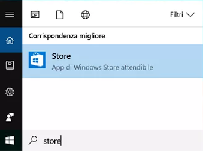
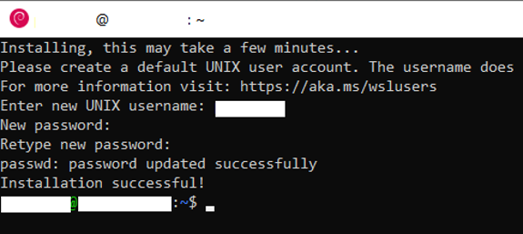
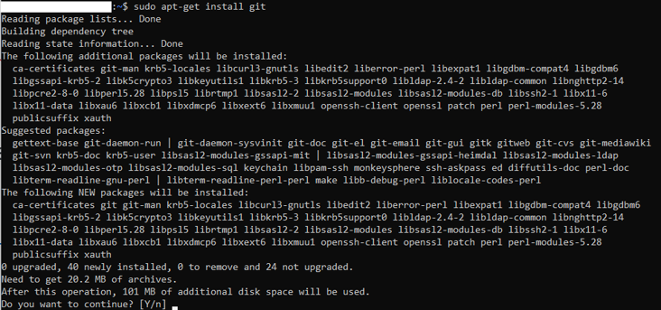
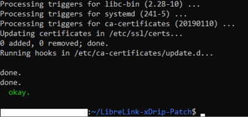
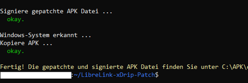

<u>Nota legale:</u> Soltanto per i residenti della comunità europea [DIRETTIVA 2009/24/CE DEL PARLAMENTO EUROPEO E DEL CONSIGLIO](https://eur-lex.europa.eu/legal-content/IT/TXT/?uri=celex:32009L0024).

## Installare un sotto-sistema Linux in Windows.

Nella lente di ingrandimento a sinistra dal menu di Windows, digitare:

`Attiva o disattiva funzionalità di Windows`

Aprire il programma e abilitare: Sottosistema Windows for Linux.

Fare `OK` e riavviare il computer.

Dal Microsoft store, cercare e installare Debian

Cliccare `Ottieni`, e `Apri`

A la prima apertura della finestra di Debian, impostare un nome utente e una password.

Nota: ogni commando in Debian va seguito dal tasto Invio.

Segnare questi dati per non perderli. Se non li ritrovate, disinstallare Debian e reinstallare per ricominciare da capo.

Digitare `sudo apt-get update` nella finestra Debian.

Digitare la propria password quando richiesta.

Installare il cliente Github con il commando `sudo apt-get install git`

Digitare `Y` e premere Invio

## Clonare il repository Github

Clonare il repository Github schmetterling2, oppure TinoKossmann se il primo non fosse disponibile con il commando seguente:

`git clone  https://github.com/schmetterling2/LibreLink-xDrip-Patch`

> Se questo repository non è più disponibile chiederà una password
> In questo caso, invio, invio:
>
> 
>
> E riprovare con:
>
> `git clone https://github.com/TinoKossmann/LibreLink-xDrip-Patch`

Normalmente dovreste visualizzare questo:

Entrare nella cartella digitando: `cd LibreLink-xDrip-Patch`\
*Trucco: scrivere **cd Li** e premere il tasto Tab*

Installare strumenti supplementari con: `./install-apt-dependencies.sh`

Digitare la password quando richiesta.

Digitare `Y`, premere invio.\
Aspettare, ci vorrà un po'.

## Scaricare l'app

Digitare `./download.sh`

## Modificare l'app

Digitare `./patch.sh`

Fatto. Potete digitare exit per chiudere Debian.

Troverete l'app modificata nella cartella `C:\\APK` del vostro computer.

<u>Nota legale:</u>  la diffusione di questa app modificata **<u>non è autorizzata</u>**

# Anleitung zum Patchen der App "LibreLink" unter Windows #

**Grundsätzliches:**

Wenn LibreLink als erstes "Gerät" mit einem FreeStyle Libre 2 gekoppelt wird, empfängt es permanent Bluetooth-Daten, um den aktuellen Gewebezucker-Wert zu berechnen und ggf. Alarm zu geben. Angezeigt werden diese Daten jedoch nur, wenn "klassisch" gescannt (der Sensor per NFC ausgelesen) wird. Dieser Patch ermöglicht es, dass [xDrip+](https://github.com/jamorham/xDrip-plus) die errechneten Werte von LibreLink auslesen und permanent anzeigen kann - ein Scannen per NFC ist nicht mehr nötig.

Um die gepatchte App auf einem Android Smartphone installieren zu können, muss auf selbigem in den Einstellungen das "Installieren aus unbekannten Quellen" erlaubt, bzw. unter neueren Android-Versionen eine entsprechende App berechtigt werden, "unbekannte Apps zu installieren".

Die original LibreLink App muss vor der Installation deinstalliert werden. **Dabei geht die Bluetooth-Kopplung zum aktuell laufenden Sensor verloren!** Sinnvollerweise wird der Wechsel der App daher beim Wechsel eines Sensors durchgeführt (falls der Alarm bis dahin per LibreLink erfolgte). Sobald die gepatchte App installiert wurde, müssen ihr noch Rechte auf "Standort" (für Bluetooth-Nutzung) und "Speicher" gewährt werden (in neueren Android-Versionen unter "Einstellungen - Apps & Benachrichtigungen - LibreLink - Berechtigungen", ansonsten ggf. den Menüpunkt "Alarme" in der App öffnen und prüfen, ob man dort nach Rechten gefragt wird). Danach kann ein neuer Sensor gestartet/gekoppelt und die App wie gewohnt genutzt werden.

In den neueren Versionen von xDrip+ (ab ["Nightly Build" vom 15. Juli 2019 oder später](https://github.com/NightscoutFoundation/xDrip/releases) (auf das obere "Assets" klicken und die APK Datei herunterladen)) gibt es in den Einstellungen die Datenquelle "Libre2 (patched App)". Diese ist auszuwählen, um die Werte ohne klassisches Scannen angezeigt zu bekommen. In xDrip+ selbst muss der Sensor ebenfalls gestartet werden, wobei dies kein "Starten" im klassischen (LibreLink) Sinn ist. Es kann etwas dauern, bis die ersten Werte in xDrip+ erscheinen.

**Vorgehen:**

Wer Linux nutzt, kann sich an die englische original Anleitung des [ursprünglichen Projekts](https://github.com/user987654321resu/Libre2-patched-App) halten oder die hier enthaltene `patch.sh` nutzen. Für Windows-Nutzer ist folgende Anleitung eventuell hilfreich, welche im Grunde ein Linux SubSystem in Windows installiert und den Patch innerhalb dieses Systems ausführt.

* Installation des Linux SubSystems

In der Windows Systemsteuerung den Punkt "Windows-Features aktivieren oder deaktivieren" wählen (oder dies einfach in der Cortana-Suchleiste eingeben), dort am Ende den Haken bei "Windows-Subsystem für Linux" auswählen und mittels Klick auf "OK" bestätigen. Den anschließend verlangten Neustart unbedingt durchführen.
Im "Microsoft Store" die App "Debian" installieren bzw. in der [Microsoft Dokumentation](https://docs.microsoft.com/de-de/windows/wsl/install-win10) zu dem Thema den Link "Debian GNU/Linux" auswählen und durch den Store bis zur Installation führen lassen. Anschließend das SubSystem Debian starten.

* Einrichtung des Linux SubSystems

Beim ersten Start des SubSystems wird nach einem Benutzernamen gefragt, der frei wählbar ist (hier aber bitte nur Kleinbuchstaben verwenden, ggf. Ziffern dahinter - keine Großbuchstaben). Sinnvollerweise nutzt man hier seinen eigenen Windows-Benutzernamen. Ebenso muss ein Passwort für diesen Benutzer vergeben werden (nicht überspringen, sondern wirklich ein Passwort setzen). Hier macht es ggf. auch Sinn, das eigene Windows-Passwort zu setzen (muss aber beides nicht zwingend sein).
Das Grundsystem ist nun vorhanden und muss mit benötigten Werkzeugen (Tools) versorgt werden. Dazu wird mittels dem Befehl `sudo apt-get update` die Paketliste auf den neuen Stand gebracht. Das eben vergebene Passwort wird dabei einmal abgefragt und ist einzugeben. Anschließend wird der Git-Client mittels `sudo apt-get install git` installiert. Die Frage, ob alle aufgeführten Pakete installiert werden sollen, wird bestätigt (Enter/Return-Taste drücken reicht dazu aus).

* Clone dieses Repositories

Mittels `git clone https://github.com/TinoKossmann/LibreLink-xDrip-Patch` wird dieses Repository heruntergeladen und anschließend per `cd LibreLink-xDrip-Patch` in das neue Verzeichnis gewechselt (Tipp: `cd Li` eintippen und Tabulator-Taste drücken). Bei Bedarf kann nun mit `ls -l` der Inhalt geprüft werden.

* Installation weiterer Tools

Weitere, benötigte Tools werden nun mittels `./install-apt-dependencies.sh` (Tipp: auch hier, `./inst` eintippen und Tabulator-Taste drücken) installiert. Sollte auch hier wieder nach einem Passwort gefragt werden, handelt es sich um das vorhin vergebene (i.d.R. wird aber nicht mehr danach gefragt). Die Frage nach der Paketliste wird wieder bestätigt.

* Laden der original LibreLink App

Wer die original APK-Datei nicht selbst herunterladen möchte, kann diese mittels `./download.sh` herunterladen. Dabei wird auch das zusätzlich benötigte Tool apktool installiert, welches im Debian-Repository in einer hier nicht ohne weiteres funktionierenden Version enthalten ist.

* Patchen und Signieren der App

Mittels `./patch.sh` wird alles nötige erledigt. Dies nimmt einige Zeit in Anspruch. Normalerweise sollten alle Schritte mit grünem "okay" abgeschlossen werden und am Ende der Hinweis erscheinen, dass die gepatchte APK-Datei im Verzeichnis C:\APK\ zu finden ist. Per `exit` kann das Fenster nun geschlossen werden.

**Video Walkthrough:**

In [diesem Video](https://www.youtube.com/watch?v=ezpGM2jR89A) ist die Anleitung einmal durchgespielt worden.

**Weitere Hinweise:**

Die gepatchte App läuft als sog. "Vordergrunddienst". Es ist daher normal, dass oben in der Taskleiste eine "Foreground Service Notification" erscheint.

Die Verbindung zu LibreView bzw. allen Onlinediensten von Abbott wurden entfernt.

Weiterhin gilt die Einschränkung, dass ein per Smartphone gestarteter Sensor nicht mit dem Lesegerät ausgelesen werden kann. Die Nutzung der gepatchten App und ihrer Vorteile bedeutet zwangsweise, dass das Lesegerät nicht mehr für diesen Sensor genutzt werden kann.

LibreLink 2.3.0 erfordert Android 5.0 oder höher.

Eine gute Anleitung zum Umgang mit xDrip+ in Verbindung mit der gepatchten App findet man u.a. [hier](https://androidaps.readthedocs.io/en/latest/CROWDIN/de/Hardware/Libre2.html).

**Grundsätzliches Vorgehen:**

(nur rudimentär, dies soll nur die Anleitung zum Patchen der App sein)

- original LibreLink deinstallieren
- Installation von Anwendungen aus "unbekannten Quellen" auf dem Smartphone erlauben, ggf. sogar "Play Protect" im PlayStore deaktiviern
- gepatchte LibreLink App installieren
- die Rechte "Standort" und "Speicher" für LibreLink erteilen
- Bluetooth und GPS einschalten und eingeschaltet lassen (im Flugmodus funktioniert das ganze nicht, teilweise auch nicht ohne GPS)
- Mindestens einen Alarm in LibreLink aktivieren
- xDrip in aktueller Version installieren
- "Libre2 (patchted App)" in xDrip als Datenquelle auswählen
- Libre2 Sensor mit gepatchter LibreLink App starten
- in xDrip Sensor "starten"
- eine Stunde warten
- Ruhe- bzw. Stomsparmodus deaktivieren, falls die Werte nachts auch durchgängig erscheinen sollen
- Sobald Werte erscheinen, kann der Alarm in LibreLink deaktiviert werden - sinnvoll, wenn xDrip mit (ggf. kalibrierten Werten) Alarm schlagen soll

---

# Original Anleitung in Englisch #

# How to patch the Librelink app to provide xDrip with Value received by bluetooth directly from sensor

**IF YOU WANT TO USE THIS, YOU NEED TO ACTIVATE A NEW SENSOR AFTER THE INSTALLATION PROCEDURE IS COMPLETED, IT DOES NOT WORK WITH ALLREADY ACTIVATED SENSORS!!**

**Already activated sensors will also stop sending alarms to the handset device if they had been activated with the unpatched phone app.**

## Get the APK and Tools
1. Load the Version 2.3.0 of the freestyle Libre App DE, for example from [here](https://apkpure.com/de/freestyle-librelink-de/com.freestylelibre.app.de) or [here](https://www.apkmonk.com/download-app/com.freestylelibre.app.de/5_com.freestylelibre.app.de_2019-04-22.apk/)
(The German version does have english language, don't worry.)

2. [OPTIONAL] If you want to check if your Version is correct, check the MD5 (for windows you might need to get an App like: 
http://www.winmd5.com to perform md5 checksumming). The Checksum should be: `420735605bacf0e18d2570079ebaa238`

3. Load the [apkTool](https://ibotpeaches.github.io/Apktool/) and install it as described [here](https://ibotpeaches.github.io/Apktool/install/). It seems that the current 2.4 Version of Apktool has some problems on Windows, please download and install an older 2.3 Version if you are using Windows!

4. Open a CMD-Prompt (windows) or Shell (\*nix) where you downloaded the apk (e.g. your download folder)

5. Use the apktool: `apktool d -o librelink [FILENAME_OF_THE_DOWNLOADED_APK]`

6. You should now have a folder named `librelink` with all the extracted files of the application
7. Copy the patch Files from this repository to the same location as the `librelink` folder (you should now have a directory with at least the following files/folders: `librelink`, `xdrip2.git.patch`, `sources` and `xdrip2.patch`)

## Patch Application 
**Use either of the two methods:**

### OPTION 1: patch method
1. For Windows, get the patch tool from [here](http://gnuwin32.sourceforge.net/packages/patch.htm) and install it correctly. Mac, Linux and *nix should have patch onboard, if not install from your trusted repository.
2. Change in the prompt/shell into the `librelink` folder
3. Use the Patch tool with the patch: `patch -p1 --binary --merge < ../xdrip2.patch`. for Windows `patch -p1 --binary --merge < ..\xdrip2.patch`. Be sure to use CMD-Prompt and not PowerShell,a s PowerShell does not support < operation.

### OPTION 2: git apply method
1. Get your git client ready. For windows install something like [this](https://gitforwindows.org)
2. Change in the prompt/shell into the `librelink` folder
3. Use igt to apply the patch: `git apply ../xdrip2.git.patch`, for Windows `git apply ..\xdrip2.git.patch`

## Add Files
1. In your Filebrowser navigate within the librelink folder to the path `smali_classes2/com/librelink/app/`
2. Copy the following Files from the `sources` folder of this repository to this folder:
	1. `ThirdPartyIntegration.smali`
	2. `ForegroundService.smali`
	3. `CrashReportUtil.smali`
	4. `APKExtractor.smali`
3. Rename the Downloaded APK to `original.apk`
4. Copy the `original.apk` into the Folder `assets` in the `librelink` folder

## Rebuild the APK

1. In the Prompt/Shell move into the folder, which contains the `librelink` folder
2. Use apktool to rebuild the APK: `apktool b -o librelink.apk librelink`
3. Generate a Signing keystore: `keytool -genkey -v -keystore librelink.keystore -alias librelink -keyalg RSA -keysize 2048 -validity 10000`
	1. Fill in the necessary informations. You must enter two passwords, one for the keystore, one for the key, you should note them down! I prefer to use rather simple passwords like both times `librelink` as this keystore is only for the resigned app
	2. **If this fails, please install current java developer tools like [this](https://www.oracle.com/technetwork/java/javase/downloads/jdk8-downloads-2133151.html)**
	3. If you need to update the App later, omit this step, as the keystore is now available.
4. Sign the APK: `jarsigner -verbose -sigalg SHA1withRSA -digestalg SHA1 -keystore librelink.keystore librelink.apk librelink`. If the jarsigner is not found in Windows, please check that your java variables are setup correctly, like described [here](https://stackoverflow.com/questions/1672281/environment-variables-for-java-installation)

## Install the new APK
5. Uninstall the current librelink app on the phone.
6. Copy the generated `librelink.apk` to your phone (USB, google drive, ... gmail will not work) and install it.

## Finished
**Open the app, go to "Alarms" and give all necessary permissions that the app requests, or else the first sensor you will start with the app will not transmit any data via Bluetooth!!!** As an alternative, you can navigate to the app in your android-settings -> security and enbale there all permission (Location and Files)

If all Steps where succesfully executed, you will have now a patched librelink app, capable of sending its data to [xDrip](https://github.com/jamorham/xDrip-plus).

Wait for more informations about which Version/Patches you need for xDrip to get the Data to Display!
